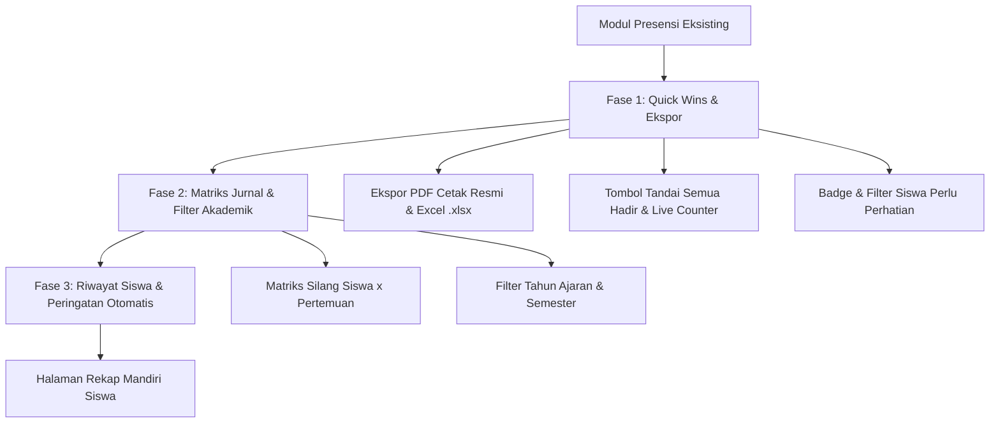

# Diskusi: Analisis, Evaluasi Kesenjangan, & Rencana Penyempurnaan Fitur Daftar Hadir (Attendance)

* **Tanggal Inisiasi:** 2026-09-16
* **Inisiator:** Antigravity AI (Pair Programming Assistant) & Developer
* **Status:** `ADOPTED` <!-- Pilihan: DRAFT | OPEN | CONSENSUS | ADOPTED | REJECTED -->
* **Terkait Dokumen:**
  - [`docs/spec/11-attendance/`](../spec/11-attendance/) (Spesifikasi Eksisting Modul Presensi)
  - [`docs/steering/business-rules.md`](../steering/business-rules.md) (Aturan Hak Akses Wali Kelas, Guru Mapel, Siswa)
  - [`docs/spec/14-exports-pdf/`](../spec/14-exports-pdf/) (Standar Ekspor Cetak & PDF Aksara)
  - [`docs/spec/17-design-system/`](../spec/17-design-system/) (Komponen UI, ExportMenu, Design Tokens)

---

## 1. Konteks & Analisis Fitur Eksisting

Modul Kehadiran ([`AttendanceRecord`](file:///c:/Users/jejak/Documents/www/Bimtek/aksara/app/Models/AttendanceRecord.php)) saat ini memiliki pondasi backend dan frontend yang sudah berjalan:
1. **Model & Skema Database:**
   - Tabel `attendance_records` memiliki kunci unik komposit `(plan_id, student_id)`.
   - Status kehadiran berbasis enum [`AttendanceStatus`](file:///c:/Users/jejak/Documents/www/Bimtek/aksara/app/Enums/AttendanceStatus.php): `present` (Hadir), `excused` (Izin), `sick` (Sakit), `absent` (Alpha).
   - Mendukung catatan opsional (`notes`) per baris kehadiran siswa.
2. **Form Pengisian Presensi (`Attendance/Form.vue`):**
   - Guru pemilik rencana ajar (`$plan->teacher_id === Auth::id()`) dapat mengisi dan menyimpan presensi per pertemuan kelas secara *upsert*.
3. **Rekapitulasi Kehadiran (`Attendance/Summary.vue`):**
   - Mendukung pemilihan rombel kelas (`classId`) dan rencana pembelajaran tertentu (`planId`).
   - Tabel menampilkan agregat: Hadir, Izin, Sakit, Alpha, dan persentase kehadiran (`%`).
   - Otorisasi terbagi rapi:
     - **Wali Kelas:** Hanya dapat melihat kelas binaannya, namun dapat memantau seluruh rencana ajar di kelas tersebut.
     - **Guru Mapel:** Hanya dapat melihat kelas dan rencana ajar miliknya.
     - **Administrator:** Memiliki hak akses menyeluruh ke seluruh kelas dan rencana ajar.
4. **Integrasi Dashboard:**
   - Ringkasan kehadiran rombel ditampilkan pada Dashboard Wali Kelas ([`WaliKelas.vue`](file:///c:/Users/jejak/Documents/www/Bimtek/aksara/resources/js/Pages/Dashboard/WaliKelas.vue)).
   - Ringkasan kehadiran anak ditampilkan pada Dashboard Wali Murid ([`WaliMurid.vue`](file:///c:/Users/jejak/Documents/www/Bimtek/aksara/resources/js/Pages/Dashboard/WaliMurid.vue)).

---

## 2. Identifikasi Kesenjangan & Masalah Nyata di Lapangan (Gap Analysis)

Berdasarkan audit alur operasional sekolah di Indonesia (SMP/SMA/Kurikulum Merdeka), ditemukan beberapa kesenjangan krusial:

### A. Ketiadaan Fitur Ekspor / Cetak Rekap Presensi (PDF & Excel)
* **Kondisi Saat Ini:** Halaman rekapitulasi ([`Summary.vue`](file:///c:/Users/jejak/Documents/www/Bimtek/aksara/resources/js/Pages/Attendance/Summary.vue)) hanya dapat dilihat di layar browser. Tidak tersedia tombol unduh atau cetak.
* **Kebutuhan Lapangan:** Guru mapel dan wali kelas diwajibkan secara administratif untuk mencetak:
  1. **Cetak PDF Resmi A4 Ber-Kop Sekolah:** Sebagai lampiran fisik perangkat ajar, bukti pelaksanaan pembelajaran, serta laporan pertanggungjawaban bulanan kepada Kepala Sekolah.
  2. **Ekspor Excel (.xlsx):** Untuk pengolahan data nilai akhir, sinkronisasi dengan aplikasi e-Rapor Dikdasmen, dan rekapitulasi semesteran.

### B. Friksi Pengisian pada Rombel Besar (30–40 Siswa)
* **Kondisi Saat Ini:** Form pengisian presensi menyajikan radio button per siswa. Guru harus memeriksa dan mengklik satu per satu tanpa tombol tindakan massal.
* **Kebutuhan Lapangan:** Pada mayoritas hari sekolah normal, 90–95% siswa hadir. Guru membutuhkan tombol aksi cepat:
  - Tombol **"Tandai Semua Hadir"** (*Mark All Present*) dengan satu klik.
  - Ringkasan langsung (*Live Counters*) di bagian bawah/atas form: Berapa siswa yang hadir, sakit, izin, dan alpa sebelum menekan tombol Simpan.

### C. Kurangnya Filter Semester & Tahun Ajaran pada Rekap
* **Kondisi Saat Ini:** Rekapitulasi mengagregasikan seluruh rencana pembelajaran yang pernah dibuat untuk kelas tersebut.
* **Kebutuhan Lapangan:** Ketika memasuki Semester Genap, presensi Semester Ganjil tidak boleh tercampur dalam perhitungan persentase kehadiran semester berjalan.

### D. Ketiadaan Tampilan Matriks Jurnal Pertemuan (Cross-Tab Grid)
* **Kondisi Saat Ini:** Tabel rekapitulasi hanya menampilkan total angka (`Hadir: 5, Izin: 1...`).
* **Kebutuhan Lapangan:** Guru dan wali kelas sering kali perlu menelusuri pada tanggal atau pertemuan mana siswa tertentu tidak hadir (contoh: matriks Siswa x Pertemuan 1, 2, 3... dengan kode H/I/S/A).

### E. Early Warning System untuk Siswa Berisiko (< 75% Kehadiran)
* **Kondisi Saat Ini:** Persentase diwarnai teks sederhana (`text-aksara-danger`).
* **Kebutuhan Lapangan:** Standar kelulusan dan syarat mengikuti asesmen sumatif/ujian mensyaratkan batas minimal kehadiran 75%–80%. Perlu ada visual highlighting (badge peringatan) dan filter cepat *"Hanya Siswa Perlu Perhatian"*.

---

## 3. Rencana Penyempurnaan Bertahap (Roadmap)

Diuraikan ke dalam paket rilis bertahap:

---

## 4. Detil Desain Fase 1 (Prioritas Tertinggi)

### 1. Ekspor Rekap Kehadiran (PDF & Excel)
- **Komponen Backend:**
  - `App\Services\AttendanceExportService`:
    - `exportPdf(SchoolClass $class, Collection $students, Collection $plans, ?LearningPlan $selectedPlan): string` (atau Blade view `exports.attendance-pdf`).
    - `exportExcel(SchoolClass $class, Collection $students, Collection $plans, ?LearningPlan $selectedPlan): string` (menggunakan `PhpOffice\PhpSpreadsheet`).
  - `App\Http\Controllers\Attendance\AttendanceExportController`:
    - Endpoint: `GET /attendance/export/{format}` dengan query param `classId` dan `planId`.
    - Otorisasi konsisten dengan `AttendanceSummaryController` (Wali Kelas, Guru Mapel kelasnya, Admin).
- **Format Tampilan PDF Cetak:**
  - Layout Landscape A4 rapi dengan Kop Surat Sekolah (`exports.partials.kop`).
  - Tabel: No, NISN, Nama Siswa, Hadir (H), Izin (I), Sakit (S), Alpha (A), Total Pertemuan, % Kehadiran, Status Keterangan.
  - Tanda tangan Guru Pengampu / Wali Kelas dan Kepala Sekolah.
- **Frontend Integration:**
  - Mengintegrasikan komponen [`ExportMenu.vue`](file:///c:/Users/jejak/Documents/www/Bimtek/aksara/resources/js/Components/ui/ExportMenu.vue) pada header `Attendance/Summary.vue`.

### 2. Peningkatan UX Form Input Presensi (`Attendance/Form.vue`)
- Tombol cepat di header tabel:
  - 🟢 **"Tandai Semua Hadir"**: Mengisi seluruh radio button siswa menjadi `present` secara instan.
  - 🔄 **"Reset ke Default"**: Mengembalikan ke status awal sebelum diedit.
- **Live Summary Bar** di bawah form (sticky / footer):
  - Menampilkan ringkasan langsung sebelum disimpan: `🟢 X Hadir · 🟡 Y Izin · 🟠 Z Sakit · 🔴 W Alpha` dari total N siswa.
- Validasi visual agar guru yakin sebelum menekan Simpan.

### 3. Visual Highlighting untuk Siswa Berisiko
- Siswa dengan persentase kehadiran `< 75%` ditandai dengan badge peringatan merah (`Perlu Perhatian`) dan sorotan warna lembut pada baris tabel rekapitulasi.

---

## 5. Rencana File & Komponen Baru

| Layer | File / Komponen | Peran |
| :--- | :--- | :--- |
| **Service** | `app/Services/AttendanceExportService.php` | Generator berkas Excel (`.xlsx`) dan penyiap data cetak PDF. |
| **Controller** | `app/Http/Controllers/Attendance/AttendanceExportController.php` | Endpoint pengatur ekspor rekapitulasi dan otorisasi. |
| **View (PDF)** | `resources/views/exports/attendance-pdf.blade.php` | Template cetak PDF Landscape resmi ber-Kop Surat Sekolah. |
| **Routes** | `routes/web.php` | Pendaftaran rute `attendance.export` (`/attendance/export/{format}`). |
| **Frontend UI** | `resources/js/Pages/Attendance/Summary.vue` | Pemasangan `ExportMenu`, badge peringatan, dan styling. |
| **Frontend UI** | `resources/js/Pages/Attendance/Form.vue` | Penambahan tombol *"Tandai Semua Hadir"* dan *Live Counter Bar*. |
| **Tests** | `tests/Feature/AttendanceExportTest.php` | Pengujian fitur ekspor otomatis lengkap (hak akses, headers, MIME). |

---

## 6. Pertanyaan Diskusi & Keputusan

1. **Format Default Ekspor:**
   - Apakah cukup menyediakan **PDF (Cetak Resmi Sekolah)** dan **Excel (.xlsx)** untuk rekap kehadiran, atau ada kebutuhan format lain (seperti CSV)?
   - *Rekomendasi:* PDF dan Excel adalah standar baku kebutuhan sekolah dan dinas pendidikan.
2. **Cakupan Ekspor:**
   - Ekspor dapat dilakukan per satu pertemuan (jika filter `planId` dipilih) atau agregat seluruh pertemuan pada rombel tersebut (jika `Semua rencana` dipilih).
3. **Pemberian Tombol "Tandai Semua Hadir":**
   - Apakah tombol ini harus meminta konfirmasi atau langsung mengisi semua status siswa menjadi Hadir?
   - *Rekomendasi:* Langsung mengisi radio button secara reaktif (karena belum tersimpan ke database sampai guru menekan tombol "Simpan").

---

## 7. Langkah Selanjutnya (Next Steps)

* [x] Review dan persetujuan arah perbaikan fitur oleh tim / developer.
* [x] Pembuatan `AttendanceExportService.php` dan template cetak `exports.attendance-pdf`.
* [x] Pembuatan `AttendanceExportController.php` dan registrasi rute ekspor.
* [x] Penyempurnaan interaktivitas `Form.vue` (Tandai Semua Hadir & Live Counter).
* [x] Pemasangan `ExportMenu` pada `Summary.vue`.
* [x] Pembuatan suite pengujian `AttendanceExportTest.php`.
* [x] Verifikasi PHPStan Level 9 murni dan Pest test suite.
