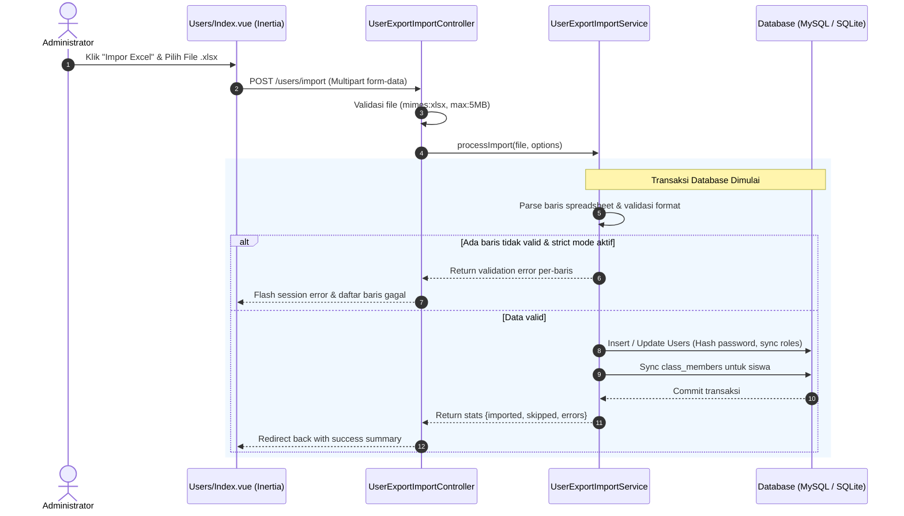

# Diskusi: Desain & Arsitektur Fitur Export / Import Data Pengguna Menggunakan Excel (.xlsx)

* **Tanggal Inisiasi:** 2026-09-16
* **Inisiator:** Antigravity AI (Pair Programming Assistant) & Developer
* **Status:** `ADOPTED` <!-- Pilihan: DRAFT | OPEN | CONSENSUS | ADOPTED | REJECTED -->
* **Terkait Dokumen:**
  - [`docs/spec/05-users/`](../spec/05-users/) (Spesifikasi Modul Manajemen Pengguna)
  - [`docs/steering/business-rules.md`](../steering/business-rules.md) (Aturan Hak Akses & Integritas Data)
  - [`docs/steering/coding-standards.md`](../steering/coding-standards.md) (Standar Kode & Larastan Level 9)
  - [`docs/spec/17-design-system/`](../spec/17-design-system/) (Design Tokens & Komponen UI)
  - [`docs/spec/18-bulk-actions/`](../spec/18-bulk-actions/) (Aksi Massal Data Tabel)

---

## 1. Konteks & Masalah Bisnis

Saat ini, modul Manajemen Pengguna ([`Users/Index.vue`](file:///c:/Users/jejak/Documents/www/Bimtek/aksara/resources/js/Pages/Users/Index.vue)) di platform Aksara hanya mendukung **pendaftaran pengguna secara manual satu per satu** melalui form modal (`UserController::store`).

### Masalah & Hambatan Nyata:
1. **Inefisiensi Onboarding Tahun Ajaran Baru:**
   - Pada awal semester atau penerimaan peserta didik baru (PPDB), administrator sekolah harus mendaftarkan puluhan guru, wali kelas, serta ratusan siswa baru (misal 200–300 siswa per angkatan).
   - Mengisi form satu per satu memerlukan waktu berjam-jam, sangat melelahkan, dan memiliki risiko tinggi *human error* (salah ketik nama, NISN, atau email).
2. **Ketiadaan Fitur Cadangan / Distribusi Akun:**
   - Administrator tidak memiliki sarana untuk mengunduh rekapitulasi data pengguna ke format Excel (`.xlsx`) yang kompatibel dengan arsip tata usaha atau integrasi Dapodik/EMIS.
   - Belum ada cara mencetak/membagikan daftar akun dan password sementara kepada wali kelas atau siswa secara kolektif.
3. **Kompleksitas Penautan Rombel Siswa:**
   - Setelah membuat akun siswa, admin harus berpindah ke menu tautkan kelas secara terpisah untuk memasukkan siswa ke rombel tertentu.

---

## 2. Proposal Solusi: Modul User Export & Import Excel

Fitur ini memanfaatkan library **`PhpOffice\PhpSpreadsheet`** yang telah terpasang di Aksara (sebagaimana digunakan pada modul Kurikulum & RPP).

### A. Fitur Ekspor Pengguna (`.xlsx`)

Fitur ekspor dirancang fleksibel dengan dua mode:
1. **Ekspor Berdasarkan Filter / Seluruh Data:**
   - Administrator dapat mengekspor data sesuai filter aktif di halaman (misal: hanya role *Siswa*, hanya role *Guru*, atau hasil pencarian kata kunci).
2. **Ekspor Baris Terpilih (*Bulk Export*):**
   - Memanfaatkan composable [`useBulkSelect`](file:///c:/Users/jejak/Documents/www/Bimtek/aksara/resources/js/Composables/useBulkSelect.js) yang sudah aktif di halaman pengguna: tombol *Ekspor Terpilih* muncul pada `BulkToolbar`.

#### Struktur Kolom Ekspor:
| No | Kolom Spreadsheet | Sumber Data di Model `User` | Keterangan |
| :--- | :--- | :--- | :--- |
| 1 | **No** | Nomor urut baris | Auto-increment 1, 2, 3... |
| 2 | **Nama Lengkap** | `$user->name` | Nama pengguna |
| 3 | **Email** | `$user->email` | Email login resmi |
| 4 | **Peran (Role)** | `$user->role->label()` | Admin / Guru / Wali Kelas / Siswa / Wali Murid |
| 5 | **Kelas / Rombel** | `$user->classes->pluck('name')->join(', ')` | Nama rombel binaan (siswa/wali kelas) |
| 6 | **Siswa Binaan** | `$user->children->pluck('name')->join(', ')` | Khusus akun Wali Murid |
| 7 | **Status Verifikasi** | `$user->email_verified_at ? 'Terverifikasi' : 'Belum'` | Status email |
| 8 | **Tanggal Dibuat** | `$user->created_at->format('d/m/Y H:i')` | Timestamp pendaftaran |

---

### B. Fitur Unduh Template Impor Resmi

Untuk meminimalkan kegagalan format impor, sistem menyediakan endpoint khusus untuk mengunduh file **`template-impor-pengguna-aksara.xlsx`**:
* **Sheet 1: Data Pengguna (Untuk Diisi)**
  - Baris 1: Header kolom yang terkunci (*freeze header*).
  - Baris 2–4: Contoh data pengisian (*sample data*).
  - **Data Validation (Dropdown):** Kolom *Peran* memiliki dropdown pilihan pasti: `Admin`, `Guru`, `Wali Kelas`, `Siswa`, `Wali Murid`.
* **Sheet 2: Referensi Rombel (Bantuan Pengisian)**
  - Menampilkan daftar nama kelas dan kode rombel aktif yang terdaftar di sistem agar admin tidak salah memasukkan nama rombel siswa.

---

### C. Fitur Impor Pengguna (`.xlsx`)

Administrator mengunggah file spreadsheet melalui modal impor di halaman `Users/Index.vue`.

#### 1. Opsi Konfigurasi Sebelum Proses Impor:
* **Penanganan Duplikasi Email:**
  - *Opsi A (Default):* **Lewati data duplikat** — Jika email sudah terdaftar, baris tersebut dilewati dan dicatat dalam laporan lewati.
  - *Opsi B:* **Perbarui data yang cocok (*Upsert*)** — Memperbarui nama dan rombel siswa tanpa mereset password yang sudah ada.
* **Strategi Password Akun Baru:**
  - *Opsi 1 (Default Seragam):* Menggunakan satu password sementara (misal admin menentukan `Aksara2026!`).
  - *Opsi 2 (Auto-Generated Random):* Sistem membuat password acak 8 karakter per akun, lalu menyediakan tombol unduh rekap kredensial hasil impor (`.xlsx`) agar admin bisa langsung membagikannya ke siswa/guru.

#### 2. Otomatisasi Relasi Siswa ke Rombel:
* Jika baris memiliki peran `Siswa` dan kolom `Rombel` diisi dengan nama/kode kelas yang cocok di database, sistem langsung menghubungkan siswa tersebut ke tabel `class_members`.

#### 3. Validasi Data & Pelaporan Error yang Bersahabat (*Row-by-Row Error Feedback*):
* Sistem memvalidasi seluruh baris sebelum melakukan *commit* (atau menggunakan *partial import* dengan log detail):
  - *Contoh error:* "Baris 12: Format email 'budi@' tidak valid."
  - *Contoh error:* "Baris 25: Rombel 'VII-Z' tidak ditemukan di database."
* Menampilkan ringkasan visual pasca-impor: **Jumlah Berhasil**, **Jumlah Dilewati**, dan **Daftar Kesalahan**.

---

## 3. Desain Arsitektur Teknis

### Diagram Alur Data Impor

### File & Komponen yang Akan Dibuat / Diperbarui:

1. **Backend Service:**
   - `app/Services/UserExportImportService.php`
   - Berisi method:
     - `exportUsers(Builder|Collection $users): string`
     - `generateTemplate(): string`
     - `importUsers(UploadedFile $file, array $options): array{imported: int, skipped: int, errors: array<string>}`
2. **Backend Controller & Request:**
   - `app/Http/Controllers/Users/UserExportImportController.php`
   - `app/Http/Requests/UserImportRequest.php`
   - Rute di `routes/web.php`:
     - `GET /users/export` (`users.export`)
     - `GET /users/template` (`users.template`)
     - `POST /users/import` (`users.import`)
3. **Frontend UI Components:**
   - [`resources/js/Pages/Users/Index.vue`](file:///c:/Users/jejak/Documents/www/Bimtek/aksara/resources/js/Pages/Users/Index.vue): Penambahan dropdown `ExportMenu` dan tombol `Impor`.
   - `resources/js/Components/users/UserImportModal.vue`: Modal interaktif berisi panduan, tombol download template, drag-and-drop file upload, dan indikator progres/error.
4. **Automated Testing Suite (Pest):**
   - `tests/Feature/UserExportImportTest.php`:
     - Test ekspor pengguna berhasil menghasilkan file binary spreadsheet valid.
     - Test download template impor menghasilkan struktur kolom yang sesuai.
     - Test impor pengguna baru berhasil membuat user dan meng-assign role Spatie.
     - Test impor siswa dengan kolom rombel otomatis terhubung ke kelas.
     - Test proteksi jika pengguna bukan admin (403 Forbidden).
     - Test penanganan validasi email duplikat dan format tidak valid.

---

## 4. Keamanan, Integritas Data & Larastan L9 Compliance

1. **Otorisasi Ketat:**
   - Seluruh endpoint ekspor & impor diproteksi oleh middleware `auth` dan otorisasi admin (`ensureCanManage()`). Guru dan siswa dilarang keras mengakses endpoint ini (403 Forbidden).
2. **Proteksi Formula Injection (CSV / Excel Injection):**
   - Untuk mencegah eksekusi formula jahat ketika spreadsheet dibuka di aplikasi desktop (Excel/Calc), setiap nilai teks yang diawali karakter `=`, `+`, `-`, atau `@` akan diawali dengan tanda kutip tunggal (`'`).
3. **Proteksi Akun Administrator yang Sedang Login:**
   - Fitur impor tidak boleh memperbarui atau menurunkan role admin yang sedang login.
4. **Batas Ukuran File & Memori:**
   - Validasi file maksimal 5MB.
   - Maksimal 1.000 baris per file impor untuk menjamin proses sinkronus selesai di bawah 10 detik tanpa menyebabkan *memory exhaustion* atau *gateway timeout*.
5. **Kepatuhan PHPStan Level 9 Murni:**
   - Seluruh method service dan controller harus memiliki tipe parameter, return type, dan generic collection yang ketat tanpa mengandalkan baseline ignores.

---

## 5. Pertimbangan & Opsi Alternatif

* **Opsi A (Sinkronus — Direkomendasikan untuk v1):**
  - Proses impor dijalankan langsung pada siklus request HTTP.
  - *Kelebihan:* Tidak memerlukan antrean background worker (Redis / `queue:work`), pengguna langsung mendapatkan hasil instan.
  - *Batasan:* Dibatasi maksimal 1.000 baris agar tidak melampaui batas eksekusi PHP (30–60 detik).
* **Opsi B (Asinkronus via Queue / Jobs — Untuk Skala Besar > 2.000 Baris):**
  - Menggunakan Laravel Queue (`ImportUsersJob`).
  - *Kelebihan:* Mendukung puluhan ribu data sekaligus tanpa risiko timeout.
  - *Kekurangan:* Memerlukan service daemon worker queue yang harus selalu berjalan di server produksi dan mekanisme polling status/notifikasi.

---

## 6. Rencana Tindak Lanjut (Next Steps)

1. [ ] Konfirmasi dan penyelarasan usulan desain bersama tim developer.
2. [ ] Implementasi backend `UserExportImportService` dan controller.
3. [ ] Implementasi frontend `UserImportModal.vue` dan integrasi di `Users/Index.vue`.
4. [ ] Penulisan feature tests di `tests/Feature/UserExportImportTest.php`.
5. [ ] Verifikasi PHPStan Level 9 (`0 errors`) & Vitest green.
6. [ ] Pembuatan dokumentasi modul resmi di `docs/spec/05-users/` dan update `docs/steering/handover.md`.
